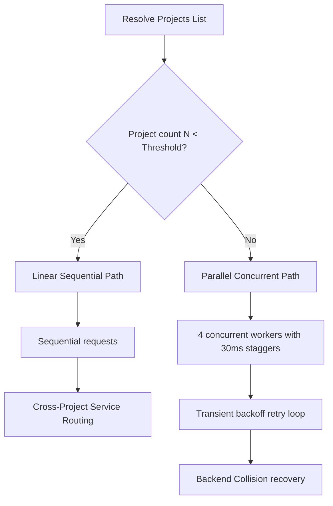

# Google Cloud API Keys Finder

[](https://github.com/minherz/api-keys-finder/actions/workflows/ci.yml)

An ultra-lightweight, high-performance Single Page Application (SPA) designed to audit and inspect active API keys across all accessible Google Cloud projects. Running entirely inside the browser with **zero backend dependencies**, it communicates directly with Google Cloud REST APIs to perform real-time key inspection, categorization, and restriction audits.

For full details on data privacy, storage lifecycles, and permissions, please see the [Security & Privacy](#-security--privacy) section.

---

## 📂 Project Structure

```
/
├── .devcontainer/       # Dev container configuration for instant workspace setup
├── deploy/              # Cloud Run Dockerfile, Nginx config, and Firebase deployment specs
├── index.html           # Main HTML5 entrypoint and layout structure for the SPA
├── skills-lock.json     # Version lockfile for Antigravity AI custom developer skills
├── vite.config.ts       # Vite bundler configuration and environment setup
├── vitest.config.ts     # Vitest test runner configuration for isolated unit testing
└── src/                 # Core application source code
    ├── api.ts           # Direct GCP REST API handshakes, customized errors, and headers
    ├── auth.ts          # Google OAuth 2.0 token management and session handling
    ├── main.ts          # SPA orchestration, OAuth flow, and path routing
    ├── scan-linear.ts   # Sequential scanner module with cross-project service routing
    ├── scan-parallel.ts # Concurrent parallel scanner with worker staggers & retries
    ├── style.css        # Clean, color-blind friendly modern CSS layout rules
    ├── types.ts         # Shared TypeScript interfaces for GCP resources and state
    ├── utils.ts         # Helper libraries for date parsing, version formatting, and log levels
    └── vite-env.d.ts    # Ambient TypeScript declarations for Vite environment variables
```

---

## 🔒 Security & Privacy

### 1. Client-Side Execution & Data Privacy
* **Zero Backend Storage or Transmission:** The application runs **100% client-side** inside your browser. No user information, profile data, project IDs, or API keys are ever transmitted to or stored on external servers, third-party databases, or analytics services. All network requests are made directly between your browser and official Google Cloud REST APIs.
* **Ephemeral Session Storage:** All authentication tokens and active session states are stored strictly in memory and browser `sessionStorage`. **No user data is stored beyond the point the window or tab is closed.**
* **Explicit Session Revocation:** Clicking **Sign Out** immediately wipes the local session and cached tokens from memory and `sessionStorage`, while issuing an explicit token revocation request to Google's OAuth 2.0 authorization server.

### 2. OAuth 2.0 Scopes
The application adheres strictly to the **Principle of Least Privilege**. When signing in, the application requests only the following non-destructive scopes:

| OAuth Scope | Type | Purpose / Justification |
| :--- | :--- | :--- |
| `openid` | Identity | Authenticates user identity via OpenID Connect. |
| `.../auth/userinfo.profile` | Identity | Retrieves user display name and avatar for the header profile menu. |
| `.../auth/userinfo.email` | Identity | Retrieves user email address for display in account details. |
| `https://www.googleapis.com/auth/cloud-platform.read-only` | GCP | Provides strictly **read-only** access to list accessible projects (`Cloud Resource Manager API`) and inspect API key metadata and restrictions (`API Keys API`). |

> [!NOTE]
> The application does **not** request broad write or administrative permissions (`cloud-platform`). It cannot create, edit, modify, or delete any GCP resources or API keys.

### 3. IAM Permissions & Role Requirements
The application operates entirely within Cloud IAM constraints and cannot bypass resource access policies:
* **Project Visibility:** The scanner only discovers GCP projects that your identity has permissions to list via the Cloud Resource Manager API.
* **Key Inspection Permissions:** The authenticated identity requires permissions equivalent to the **API Keys Viewer** (`roles/serviceusage.apiKeysViewer`) role (specifically `serviceusage.apiKeys.list` and `serviceusage.apiKeys.get`) on the targeted projects.
* **Firebase Hosting Service Agent IAM:** When utilizing Firebase Hosting rewrites to Cloud Run, the **Firebase Hosting Service Agent** (`service-<PROJECT_NUMBER>@gcp-sa-firebasehosting.iam.gserviceaccount.com`) must be granted the **Cloud Run Invoker** (`roles/run.invoker`) role on the Cloud Run service.

### 4. Zero Cost & Non-Billable APIs
All Google Cloud APIs invoked by this application ([Cloud Resource Manager API](https://cloud.google.com/resource-manager/docs) and [API Keys API](https://cloud.google.com/api-keys/docs)) are free of charge. Running scans across your projects incurs **zero Google Cloud billing costs**.

---

## ⚙️ Technical Scan Architecture & Dual-Path Design

To provide an optimal balance between execution speed, system resilience, and gateway safety, the scanner features a **dynamic dual-path execution engine**:



### 1. Dynamic Path Transition Threshold (Default: 64)
The scanner evaluates the count of projects $N$ against a customizable threshold $T$ (which defaults to `64` but can be adjusted via LocalStorage) to select the optimal path:
*   **Linear Path ($N < T$):** Executes sequential, race-free HTTP requests. This guarantees that scans complete safely in under ~22 seconds even in the absolute worst-case scenario (where $N-1$ projects are service-disabled and require dual-pass scanning):
    $$T_{\text{worst\_linear}} = (N - 1) \cdot 0.35\text{s} + 0.20\text{s}$$
*   **Parallel Path ($N \ge T$):** Switches to high-throughput parallel execution utilizing **4 concurrent worker queues** processed in sequential batches of 12.

### 2. Microscopic Worker Staggers
In parallel mode, the engine introduces a synchronous **$30\text{ms}$ worker startup stagger**. This microscopic delay spaces out consecutive outgoing HTTP handshakes, preventing the Google Front End (GFE) gateway from triggering transient rate blocks due to simultaneous sub-millisecond OAuth validation calls.

### 3. Cross-Project Service Routing (`x-goog-user-project`)
When calling the API Keys API on a project where the service has not been explicitly activated, Google Cloud REST APIs return a `SERVICE_DISABLED` error.
*   **The Solution:** The scanner identifies the first accessible project in the signed-in user's project list where the API is active, designating it as the **Quota Project** (`quotaProjectId`).
*   **Routing:** For all subsequent projects where the API is not active, the scanner appends the quota project's ID in the `x-goog-user-project` HTTP header. This routes the service enablement check through the user's active project, safely bypassing disabled blocks without requiring manual API enablement on every project.

### 4. GFE Backend Collision Recovery (`[BACKEND_COLLISION]`)
High-concurrency browser clients firing parallel requests with the same OAuth token can cause sub-millisecond replication lags or locking contentions within Google's IAM gateway. This causes the gateway to throw empty `403 Forbidden` responses.
*   **Suspected Collision:** If a `403` occurs without a structured detail reason block during parallel execution waves, the scanner identifies it as a GFE backend collision.
*   **Recovery:** The scanner logs `[BACKEND_COLLISION]`, pauses, and triggers an immediate retry with exponential backoff and randomized jitter to resolve gateway contention.

---

## 🛠️ Local Development & Configuration

To run or build the application locally, you **must explicitly define** the `VITE_GOOGLE_OAUTH_CLIENT_ID` environment variable containing a registered Google OAuth 2.0 Client ID.

### Environment Variables
* `VITE_GOOGLE_OAUTH_CLIENT_ID` (**Required**): Google OAuth 2.0 Web Client ID with authorized JavaScript origins matching your hosting or local development URL (e.g. `http://localhost:5173`).
* `VITE_APP_VERSION` (*Optional*): Custom version string (e.g. `v0.0.1+a1b2c3d`). Defaults to `v0.0.1` if omitted.

### 1. Using a `.env` File (Recommended)
Create a `.env` file in the project root directory:

```env
VITE_GOOGLE_OAUTH_CLIENT_ID=your-client-id.apps.googleusercontent.com
```

### 2. Available Development Commands
```bash
export VITE_GOOGLE_OAUTH_CLIENT_ID="your-client-id.apps.googleusercontent.com"

# Run local development server
npm run dev

# Run Vitest unit tests
npm test

# Build production bundle to dist/
npm run build
```

---

## 🎛️ Diagnostic Configuration & Developer Controls

To prevent browser console clutter for standard production users, all verbose scanner telemetry (including queue steps, backlog sweeps, and request HTTP headers) is silenced by default. Developers can dynamically control verbosity and routing paths at runtime using the browser's **Developer Console (LocalStorage)**:

### 1. Enable Verbose Debug Logging
Activate detailed diagnostic telemetry logs:
*   **Enable Logs:** Open your browser's Developer Tools Console (F12) and run:
    ```javascript
    localStorage.setItem('api_keys_scanner_debug', 'true')
    ```
    Then refresh the page.
*   **Disable Logs:** Run the following in the console:
    ```javascript
    localStorage.removeItem('api_keys_scanner_debug')
    ```

### 2. Configure Path Selection Threshold (Debugging Parallel Scans)
By default, the application runs sequential scanning if the project count is less than `64`. To test parallel execution in live environments with a small number of projects:
*   **Force Parallel Scan:** Drop the threshold to `1` so the parallel concurrent scanner is forced on all runs:
    ```javascript
    localStorage.setItem('api_keys_scanner_threshold', '1')
    ```
*   **Restore Default (64 projects):** Run:
    ```javascript
    localStorage.removeItem('api_keys_scanner_threshold')
    ```

---

## 🚀 Deployment & Versioning

### Path-Based Hosting
The application is configured with `base: '/api-keys/'` in `vite.config.ts` to support path-based reverse proxy hosting (e.g. `https://your-domain.com/api-keys/`).

### Hybrid Versioning & Traceability
The footer status bar displays the active application version using a hybrid format (`v<semver>+<commit-sha>`, e.g., `v0.0.1+a1b2c3d`).
* The commit SHA is rendered as a clickable link leading directly to the commit on GitHub for operational traceability.
* Pass `VITE_APP_VERSION` during CI/CD build steps to override the version string dynamically.

### CI Preview Channel Deployment
During the GitHub Actions CI workflow ([ci.yml](file:///.github/workflows/ci.yml)), a temporary `deploy/public` directory is created dynamically (`mkdir -p deploy/public`) right before invoking Firebase Hosting channel deployment. This satisfies Firebase CLI's directory existence check for `"public": "public"` in `deploy/firebase.json` without requiring empty placeholder directories to be committed to source control.

---

## 📋 Expectations & Pre-requisites

Before using this application, please ensure your environment and account meet the following operational expectations:

### 1. Supported Account Types
The application utilizes standard Google OAuth 2.0 User-Agent flow. You can sign in using:
*   A native **Google Cloud Identity** directory account (such as Google Workspace enterprise identities).
*   A standard, public **Gmail account** (`@gmail.com`).
*   An account from an **external Identity Provider (IdP)** (e.g., Okta, Ping, Azure AD) that is federated with Google Cloud via SAML or OIDC.

For details on authentication data handling and OAuth scopes, see [Security & Privacy](#-security--privacy).

### 2. IAM Permissions & Access Control
Access control and resource discovery are governed by Google Cloud IAM. Please see [Security & Privacy → IAM Permissions & Role Requirements](#3-iam-permissions--role-requirements) for complete details on required viewer roles and project visibility permissions.

### 3. Service Enablement Constraints
*   The scanner relies on the API Keys API (`apikeys.googleapis.com`) to query keys.
*   At least **one** project in the signed-in user's accessible list **must have the API Keys API active**. Without at least one active project, the scanner cannot establish a quota project for `x-goog-user-project` routing. In this scenario, the scan will gracefully complete with notifications reporting that the API is disabled on un-activated projects.

### 4. Hosting & Deployment IAM
When deploying with Firebase Hosting rewrites to Cloud Run, refer to [Security & Privacy → IAM Permissions & Role Requirements](#3-iam-permissions--role-requirements) for the required Service Agent Invoker configuration.
