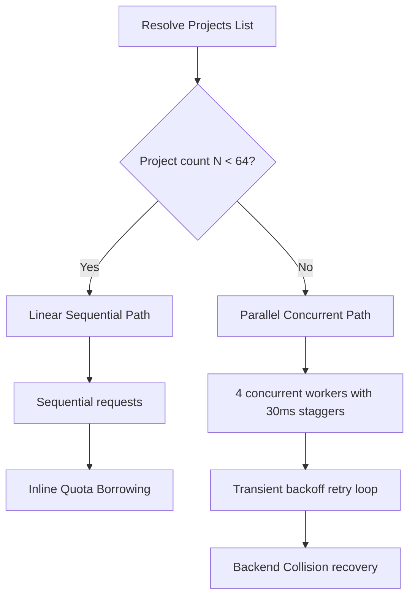

# Google Cloud API Keys Finder

[](https://github.com/minherz/api-keys-finder/actions/workflows/ci.yml)

An ultra-lightweight, high-performance Single Page Application (SPA) designed to audit and inspect active API keys across all accessible Google Cloud projects. Running entirely inside the browser with **zero backend dependencies**, it communicates directly with Google Cloud REST APIs to perform real-time security scanning, categorization, and restriction checks.

---

## 📂 Project Structure

```
/
├── .devcontainer/       # Dev container configuration for instant workspace setup
├── deploy/              # Cloud Run Dockerfile, Nginx config, and Firebase deployment specs
├── firebase.json        # Firebase hosting configuration
├── index.html          # Main HTML5 entrypoint and layout structure for the SPA
├── skills-lock.json    # Version lockfile for Antigravity AI custom developer skills
├── vite.config.ts       # Vite bundler configuration and environment setup
├── vitest.config.ts     # Vitest test runner configuration for isolated unit testing
└── src/                # Core application source code
    ├── api.ts          # Direct GCP REST API handshakes, customized errors, and headers
    ├── api.test.ts     # Mock REST client API tests (Vitest)
    ├── auth.ts         # Google OAuth 2.0 token management and session handling
    ├── main.ts         # SPA orchestration, OAuth flow, and path routing
    ├── scan-linear.ts   # New: Sequential scanner module with inline quota-borrowing
    ├── scan-linear.test.ts # New: Unit tests for sequential scanning
    ├── scan-parallel.ts # New: Concurrent parallel scanner with worker staggers & retries
    ├── scan-parallel.test.ts # New: Unit tests for concurrent scanning & error fallbacks
    ├── style.css       # Clean, color-blind friendly modern CSS layout rules
    ├── types.ts        # Shared TypeScript interfaces for GCP resources and state
    ├── utils.ts        # Helper libraries for date parsing, version formatting, and log levels
    ├── utils.test.ts   # Unit tests for core utilities and restriction evaluators
    ├── vite-env.d.ts   # Ambient TypeScript declarations for Vite environment variables
    └── vite.config.test.ts # Unit tests for Vite configuration factory
```

---

## ⚙️ Technical Scan Architecture & Dual-Path Design

To provide an optimal balance between execution speed, system resilience, and gateway safety, the scanner features a **dynamic dual-path execution engine**:



### 1. The 64-Project Transition Threshold
The scanner evaluates the count of projects $N$ in the user's accessible list to select the optimal path:
*   **Linear Path ($N < 64$):** Executes sequential, race-free HTTP requests. This guarantees that scans complete safely in under ~22 seconds even in the absolute worst-case scenario (where $N-1$ projects are service-disabled and require dual-pass scanning):
    $$T_{\text{worst\_linear}} = (N - 1) \cdot 0.35\text{s} + 0.20\text{s}$$
*   **Parallel Path ($N \ge 64$):** Switches to high-throughput parallel execution utilizing **4 concurrent worker queues** processed in sequential batches of 12.

### 2. Microscopic Worker Staggers
In parallel mode, the engine introduces a synchronous **$30\text{ms}$ worker startup stagger**. This microscopic delay spaces out consecutive outgoing HTTP handshakes, preventing the Google Front End (GFE) gateway from triggering transient rate blocks due to simultaneous sub-millisecond OAuth validation calls.

### 3. Dynamic Quota-Borrowing & Billing Anchors (`quotaProjectId`)
Because Google Cloud REST APIs implicitly charge quota/billing to the project owning the API Key resource, calling `apikeys.googleapis.com` on a project with the service disabled results in a permanent `SERVICE_DISABLED` error block.
*   **The Solution:** The scanner identifies the first accessible project where the API is enabled, marking it as the **Quota Project Anchor** (`quotaProjectId`).
*   **Borrowing:** For all subsequent service-disabled projects, the scanner borrows Service Usage quota by appending the active project's ID in the `x-goog-user-project` HTTP header, safely bypassing disabled blocks on other projects.

### 4. GFE Backend Collision Recovery (`[BACKEND_COLLISION]`)
High-concurrency browser clients firing parallel requests with the same OAuth token can cause sub-millisecond replication lags or locking contentions within Google's IAM gateway. This causes the gateway to throw empty `403 Forbidden` responses.
*   **Suspected Collision:** If a `403` occurs without a structured detail reason block during parallel execution waves, the scanner identifies it as a GFE backend collision.
*   **Recovery:** The scanner logs `[BACKEND_COLLISION]`, pauses, and triggers an immediate retry with exponential backoff and randomized jitter to resolve gateway contention.

---

## 🛠️ Local Development & Configuration

To run or build the application locally, you **must explicitly define** the `VITE_GOOGLE_OAUTH_CLIENT_ID` environment variable containing a registered Google OAuth 2.0 Client ID.

> [!IMPORTANT]
> **OAuth Client ID parent project prerequisite:**
> The Google Cloud project that **owns the OAuth 2.0 Client ID** (used in `VITE_GOOGLE_OAUTH_CLIENT_ID`) **must have the API Keys API (`apikeys.googleapis.com`) enabled**. 
> Because Google's API gateway implicitly charges service usage quota to the project associated with the OAuth Client ID by default during REST handshakes, failing to enable the API on this project will cause all downstream scans to fail with `SERVICE_DISABLED` (even on target projects where the API is enabled).

### Environment Variables
* `VITE_GOOGLE_OAUTH_CLIENT_ID` (**Required**): Google OAuth 2.0 Client ID for GCP authentication.
* `VITE_APP_VERSION` (*Optional*): Custom version string (e.g. `v0.0.1+a1b2c3d`). Defaults to `v0.0.1` if omitted.

### 1. Using a `.env` File (Recommended)
Create a `.env` file in the project root directory:

```env
VITE_GOOGLE_OAUTH_CLIENT_ID=your-client-id.apps.googleusercontent.com
```

### 2. Available Development Commands
```bash
export VITE_GOOGLE_OAUTH_CLIENT_ID="your-client-id.apps.googleusercontent.com"

# Run local development server
npm run dev

# Run Vitest unit tests
npm test

# Build production bundle to dist/
npm run build
```

### 3. Developer Console Diagnostics (LocalStorage logs)
To prevent console clutter for production users, all verbose scanner telemetry (including queue steps, backlog Sweeps, and HTTP headers) is silenced by default. To activate deep diagnostics:
*   **Enable Debug Logs:** Open your browser's Developer Tools (Chrome/Firefox Console) and run:
    ```javascript
    localStorage.setItem('api_keys_scanner_debug', 'true')
    ```
    Then refresh the page.
*   **Disable Debug Logs:** Open Console and run:
    ```javascript
    localStorage.removeItem('api_keys_scanner_debug')
    ```

*   **Adjust Path Selection Threshold (Debugging Parallel Scans):** By default, the application runs sequential scanning if the project count is less than `64`. To test parallel scanning in real-world accounts with fewer projects:
    *   **Force Parallel Scan:** Run the following command in the console to drop the threshold to `1`, which forces the parallel concurrent scanner on all scans:
        ```javascript
        localStorage.setItem('api_keys_scanner_threshold', '1')
        ```
    *   **Restore Default (64 projects):** Run:
        ```javascript
        localStorage.removeItem('api_keys_scanner_threshold')
        ```

---

## 🚀 Deployment & Versioning

### Path-Based Hosting
The application is configured with `base: '/api-keys/'` in `vite.config.ts` to support path-based reverse proxy hosting (e.g. `https://your-domain.com/api-keys/`).

### Hybrid Versioning & Traceability
The footer status bar displays the active application version using a hybrid format (`v<semver>+<commit-sha>`, e.g., `v0.0.1+a1b2c3d`).
* The commit SHA is rendered as a clickable link leading directly to the commit on GitHub for operational traceability.
* Pass `VITE_APP_VERSION` during CI/CD build steps to override the version string dynamically.

### CI Preview Channel Deployment
During the GitHub Actions CI workflow ([ci.yml](file:///.github/workflows/ci.yml)), a temporary `deploy/public` directory is created dynamically (`mkdir -p deploy/public`) right before invoking Firebase Hosting channel deployment. This satisfies Firebase CLI's directory existence check for `"public": "public"` in `deploy/firebase.json` without requiring empty placeholder directories to be committed to source control.

---

## 📋 Expectations & Pre-requisites

Before using this application, please ensure your environment and account meet the following operational expectations:

### 1. Supported Account Types
The application utilizes standard Google OAuth 2.0 User-Agent flow. You can sign in using:
*   A native **Google Cloud Identity** directory account (such as Google Workspace enterprise identities).
*   A standard, public **Gmail account** (`@gmail.com`).
*   An account from an **external Identity Provider (IdP)** (e.g., Okta, Ping, Azure AD) that is federated with Google Cloud via SAML or OIDC.

### 2. IAM Permissions & Role Requirements
The scanner cannot bypass Cloud IAM resource policies. To see keys:
*   **Project Visibility:** You will only discover keys in GCP projects that your authenticated identity has permissions to list via the Cloud Resource Manager API.
*   **Key Inspection Permissions:** You must have permissions equivalent to the **API Keys Viewer** (`roles/serviceusage.apiKeysViewer`) role on the targeted projects. Specifically, the identity needs `serviceusage.apiKeys.list` to fetch key metadata and check restrictions.

### 3. Service Enablement Constraints
*   The scanner relies on the API Keys API (`apikeys.googleapis.com`) to query keys.
*   At least **one** project in your accessible list **must have the API Keys API active**. Without at least one active project, the scanner cannot establish a `quotaProjectId` to act as a billing anchor. In this rare scenario, the scan will gracefully complete with errors reporting that the API is disabled.

### 4. Firebase Hosting Service Agent IAM Role
When using Firebase Hosting rewrites to Cloud Run, the **Firebase Hosting Service Agent** (`service-<PROJECT_NUMBER>@gcp-sa-firebasehosting.iam.gserviceaccount.com`) must be granted the **Cloud Run Invoker** (`roles/run.invoker`) role on the Cloud Run service. This enables Firebase Hosting's proxy to invoke the underlying Cloud Run revision.
